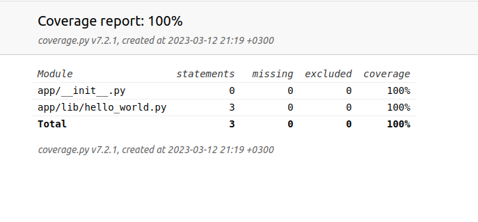

## Соглашения по стилю написания кода

### 1. Сконфигурируйте свою IDE для использования pylint:
Для Visual Studio Code вы можете использовать такие настройки (для папки с проектом):
```json
{
  "eslint.enable": true,
  "eslint.lintTask.enable": true,
  "eslint.nodePath": "./frontend/node_modules",
  "eslint.onIgnoredFiles": "warn",
  "eslint.run": "onSave",
  "pylint.path": [
    "/home/username/.local/bin/pylint"
  ],
  "pylint.args": [
    "--rcfile=api/.pylintrc"
  ]
}
```

Если вы не знаете путь к pylint, можете в терминале запустить команду, которая покажет его:
```bash
$ which pylint
=> /home/username/.local/bin/pylint
```

### 2. Запускайте все проверки перед тем, как отправить ветку в репозиторий
Это является хорошей практикой, когда вы выполняете все проверки локально, перед тем как публиковать изменения.
Для запуска pylint:
```bash
./docker/run_pylint.sh
```


### Документация методов и классов
Оборачивайте всю документацию в тройные одинарные кавычки. Это касается документации модуля (вверху файла),
документации класса (вверху класса), документации метода - вверху метода. Будьте лаконичны.

```pyton
''' Этот файл содержит тесты для функции возведения в квадрат '''

class SquareTestCase(unittest.TestCase):
  ''' Проверяет возведение в квадрат '''

  def test_for_positive(self):
    ''' Проверяет возведение в квадрат для положительного аргумента '''
```

### Проверка степени покрытия кода проекта тестами
Обычно так и говорят: "Покрытие". После запуска тестов отчёт о покрытии формируется автоматически.
Выглядит он примерно так:

Находится он [тут](../coverage/report/index.html). Для просмотра файл `./coverage/report/index.html` нужно открыть в браузере
