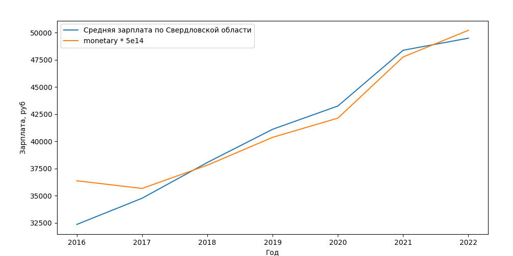

# Расчёт абсолютных значений monetary

Исходный набор данных содержит monetary в нормализованном виде:
```
==== describe =====
       monetary
count  5.203280e+07
mean   2.349952e-08
std    1.418951e-04
min    0.000000e+00
10%    7.639284e-13
20%    2.182653e-12
30%    4.474438e-12
40%    8.316496e-12
50%    1.242901e-11
60%    1.859620e-11
70%    2.692629e-11
80%    4.250416e-11
90%    8.294080e-11
max    1.000000e+00
```

Возьмём всех клиентов, у которых выполняется два пополнения за месяц, на протяжение хотя бы 6 месяцев в году. Найдём по таким клиентам среднюю величину суммы monetary за каждый месяц.

В итоге получим таблицу, в которой будет четыре колонки:
  * `year`: год;
  * `average_salary`: средняя зп за этот год по [данным росстата](https://gogov.ru/average-salary/svo#data);
  * `average_monetary`: средняя monetary в нормализованном виде;
  * `absolute_monetary`: monetary в рублях;

| year | average_salary | average_monetary | absolute_monetary |
|------|----------------|------------------|-------------------|
| 2016 |          32348 |     7.273397e-11 |          36366.98 |
| 2017 |          34760 |     7.132552e-11 |          35662.75 |
| 2018 |          38052 |     7.561025e-11 |          37805.12 |
| 2019 |          41110 |     8.073407e-11 |          40367.03 |
| 2020 |          43256 |     8.427763e-11 |          42138.81 |
| 2021 |          48390 |     9.554283e-11 |          47771.41 |
| 2022 |          49500 |     1.004543e-10 |          50227.15 |

На графике это будет выглядеть так:



Здесь голубым представлена средняя з/п по Свердловской области, А оранжевым - monetary, помноженная на 5e<sup>14</sup>

Порядок вычисления средней monetary см. [тут](../../tasks/define_monetary.py).

Итого: грубо monetary можно переводить в абсолютные значения, умножая на коэффициент 5e<sup>14</sup>
